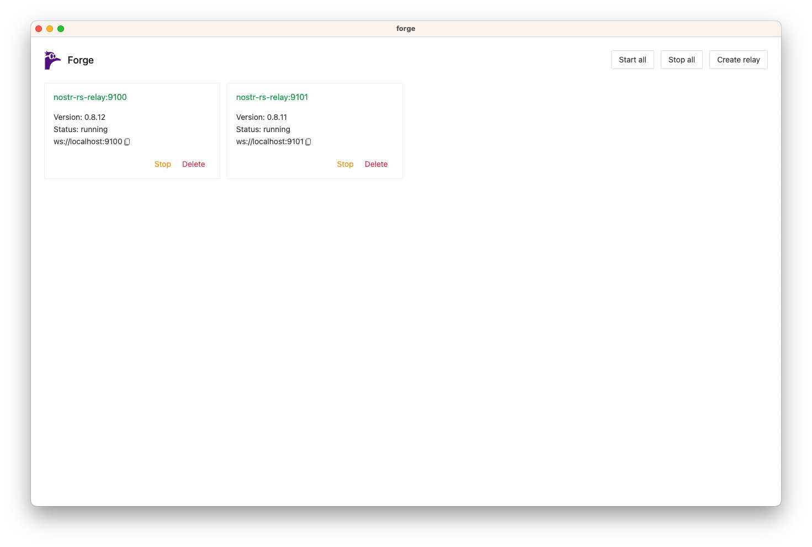
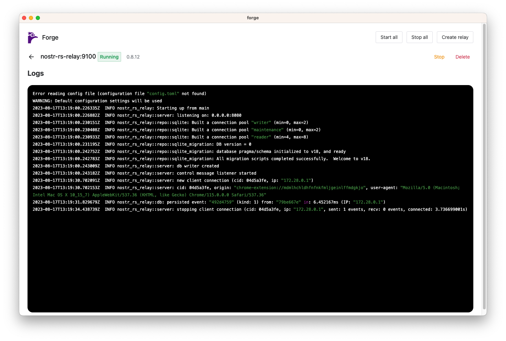

# Forge

A desktop app to play with nostr in local

<table>
  <tr>
    <td>
      
      <p align="center">Create, manage, start and stop relays</p>
    </td>
    <td>
      
      <p align="center">Get relay logs</p>
    </td>
  </tr>
</table>

🚨 Until the first official release, you may need to erase all data (IndexedDB and ~/.forge/*)

## Development

```sh
pnpm install
pnpm run dev
```

## Installation

Soon. Not released yet.

Alternative
```sh
pnpm install
pnpm run build
```

## Features

- [x] Deploy local relays with docker
    - [x] [nostr-rs-relay](https://github.com/scsibug/nostr-rs-relay)
    - [ ] [nostream](https://github.com/Cameri/nostream/tree/v1.25.2)
    - [ ] [strfry](https://github.com/hoytech/strfry)
    - ...other
- [ ] Tool like [nak](https://nak.nostr.com/)
- [ ] Generate fake events and publishing them on local relays

## Todo

- Docker status detection (stopping docker while the app is running)
- Verify it works fine on Windows, Linux and Mac
- Import custom config for each relay type on creation (eg. config.toml for nostr-rs-relay)
- Create dedicated volume for each relay (for db, config files etc)
- Mimic failing/flapping/slow relays

## License

Public domain.